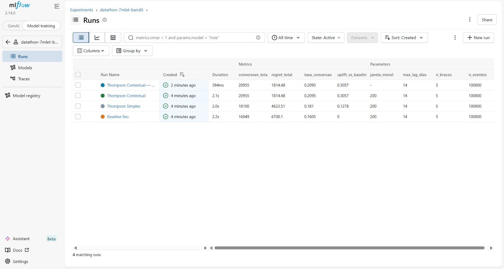

# Machine Learning Repository - BANK MARKETING DATASET
## Documentação Técnica e Dicionário de Dados para Modelagem Preditiva
**Data de Elaboração:** 18 de junho de 2026

---

## 1. Informações Gerais
Este documento fornece as especificações técnicas e a descrição detalhada do **Bank Marketing Dataset**, utilizado como base factual para a construção de uma plataforma de experimentação adaptativa de ofertas financeiras. O dataset contém informações sobre campanhas de marketing direto (chamadas telefônicas) de uma instituição bancária portuguesa e é usado exclusivamente como fonte de **perfis de clientes reais** para alimentar o simulador de decisão.

* **Link de Acesso:** [Kaggle - Bank Marketing](https://www.kaggle.com/datasets/henriqueyamahata/bank-marketing)
* **Versão Utilizada:** `bank-additional-full.csv` (versão completa)
* **Arquivo de entrada:** `./bank-additional-full.csv` (separador `;`)
* **Licença:** CC0 1.0 Universal (Public Domain)
* **Criadores:** Sérgio Moro (ISCTE-IUL), Paulo Cortez (Univ. Minho), Paulo Rita (ISCTE-IUL)
* **Ano de Publicação:** 2014

---

## 2. Descrição do Dataset
O dataset original registra campanhas de telemarketing de um banco português com o objetivo de prever se um cliente irá subscrever um depósito a prazo (variável target `y`). Neste projeto, o dataset **não é usado para treinar um modelo preditivo clássico** — ele serve como fonte de perfis de clientes reais (idade, profissão, estado civil, escolaridade, situação financeira) que alimentam o ambiente de simulação do Multi-Armed Bandit.

* **Número de Instâncias:** 41.188 registros
* **Número de Atributos usados:** 7 variáveis de contexto do cliente + target `y`
* **Período dos Dados:** Maio de 2008 a novembro de 2010
* **Valores Faltantes:** Não existem `NaN`. Dados ausentes são codificados como `"unknown"` em variáveis categóricas — tratados como missing durante a preparação.
* **Desbalanceamento:** Aproximadamente 88% dos registros têm `y="no"`, o que é levado em conta na calibração das probabilidades sintéticas.

---

## 3. Atributos e Features

### 3.1. Dados do Cliente Bancário — Colunas Utilizadas como Contexto de Decisão
| Atributo | Descrição | Tipo |
| :--- | :--- | :--- |
| **age** | Idade do cliente | Numérico |
| **job** | Tipo de profissão (12 categorias: `admin.`, `blue-collar`, `entrepreneur`, `housemaid`, `management`, `retired`, `self-employed`, `services`, `student`, `technician`, `unemployed`, `unknown`) | Categórico |
| **marital** | Estado civil (`divorced`, `married`, `single`, `unknown`) | Categórico |
| **education** | Nível educacional (`basic.4y`, `basic.6y`, `basic.9y`, `high.school`, `illiterate`, `professional.course`, `university.degree`, `unknown`) | Categórico |
| **default** | Possui crédito em inadimplência? (`no`, `yes`, `unknown`) | Categórico |
| **housing** | Possui empréstimo habitacional? (`no`, `yes`, `unknown`) | Categórico |
| **loan** | Possui empréstimo pessoal? (`no`, `yes`, `unknown`) | Categórico |


---

## 4. Enriquecimento Sintético, Baseline e Estratégia Algorítmica

### 4.1. Objetivo da Camada de Experimentação Adaptativa
O dataset Kaggle entra apenas como fonte de **perfis de clientes realistas**. Sobre esses perfis, constrói-se uma camada sintética completa de experimentação adaptativa: o sistema decide, a cada interação, qual das 5 ofertas financeiras apresentar para maximizar conversões, equilibrando exploração de novas estratégias e explotação do conhecimento já acumulado.

A separação é explícita:
- **Kaggle (real):** `age`, `job`, `marital`, `education`, `default`, `housing`, `loan` — perfil do cliente
- **Sintético (gerado):** catálogo de ofertas, probabilidades de conversão, eventos de impressão, recompensas com delay

### 4.2. Catálogo Sintético de Braços e Ofertas
O catálogo define 5 ofertas financeiras, cada uma atuando como um "braço" do Multi-Armed Bandit. As probabilidades de conversão são **hipóteses de domínio financeiro**, não dados observados:

| ID | Oferta | Canal | Base Rate | Reward Val |
| :--- | :--- | :--- | :---: | :---: |
| **OFF_001** | Cartão de crédito sem anuidade | `app_mobile` | 10% | 1.0 |
| **OFF_002** | CDB 120% CDI | `internet_banking` | 7% | 2.0 |
| **OFF_003** | Seguro de vida | `app_mobile` | 6% | 2.5 |
| **OFF_004** | Empréstimo pessoal pré-aprovado | `sms` | 13% | 1.2 |
| **OFF_005** | Previdência privada PGBL | `internet_banking` | 5% | 3.0 |

**Boosts por perfil de cliente** (ajustes sobre o `base_rate`):

| Oferta | Flag | Boost | Hipótese |
| :--- | :--- | :---: | :--- |
| OFF_001 | `job_admin.` | +0.06 | Perfis administrativos têm maior afinidade digital |
| OFF_001 | `job_student` | +0.05 | Estudantes são o público primário de primeiro cartão |
| OFF_001 | `job_technician` | +0.05 | Técnicos jovens respondem bem a produtos digitais |
| OFF_001 | `marital_single` | +0.07 | Solteiros sem dependentes priorizam crédito rotativo |
| OFF_001 | `yes_default` | -1.0 | **Bloqueio de suitability:** inadimplentes não recebem cartão |
| OFF_002 | `job_management` | +0.10 | Gestores com capital disponível preferem renda fixa |
| OFF_002 | `job_retired` | +0.06 | Aposentados valorizam segurança de investimento |
| OFF_002 | `edu_university` | +0.08 | Maior escolaridade correlaciona com interesse em CDB |
| OFF_002 | `age_senior` | +0.05 | Seniores têm horizonte de preservação de capital |
| OFF_003 | `job_retired` | +0.12 | Maior boost do catálogo — aposentados são público-alvo primário |
| OFF_003 | `age_senior` | +0.08 | Percepção de risco familiar aumenta com a idade |
| OFF_003 | `marital_married` | +0.04 | Casados com dependentes valorizam proteção |
| OFF_004 | `job_blue-collar` | +0.08 | Trabalhadores industriais têm maior necessidade de crédito |
| OFF_004 | `job_housemaid` | +0.07 | Perfil de baixa renda com demanda por crédito imediato |
| OFF_004 | `has_loan` | -0.05 | Penalidade: já ter empréstimo reduz propensão |
| OFF_004 | `yes_default` | -1.0 | **Bloqueio de suitability:** inadimplentes não recebem empréstimo |
| OFF_005 | `job_management` | +0.10 | Gestores têm incentivo fiscal para PGBL |
| OFF_005 | `job_self-employed` | +0.10 | Autônomos sem INSS robusto priorizam previdência |
| OFF_005 | `edu_university` | +0.10 | Maior escolaridade correlaciona com planejamento de longo prazo |
| OFF_005 | `age_senior` | +0.06 | Proximidade da aposentadoria aumenta urgência do PGBL |

A função de probabilidade é aditiva: `P(conv | cliente, oferta) = base_rate + Σ boosts_ativos`, limitada ao intervalo `[0.02, 0.95]`.

### 4.3. Segmentação Contextual
O Thompson Contextual agrupa clientes em segmentos usando 3 dimensões derivadas das colunas do Kaggle:

```
segmento = f"{job}__{age_group}__{edu_group}"
```

- **age_group:** `young` (≤ 30), `mid` (31–54), `senior` (≥ 55)
- **edu_group:** `university` (university.degree), `basic` (basic.*), `other` (demais)

Exemplo: `retired__senior__basic`, `student__young__university`, `management__mid__university`

Cada combinação segmento × oferta mantém parâmetros Beta independentes — o aprendizado de aposentados não interfere no aprendizado de estudantes.

### 4.4. Geração de Eventos e Ambiente de Simulação
Todo o fluxo de simulação usa semente estrita `numpy.random.default_rng(seed=42)` para reprodutibilidade completa. O ambiente gera deterministicamente:

- **N_EVENTOS:** 100.000 rounds de simulação
- **Comparação justa:** os três algoritmos recebem exatamente o mesmo cliente e o mesmo número aleatório por round — qualquer diferença de resultado vem do algoritmo, não do acaso
- **Timestamp:** cada evento recebe timestamp sintético entre 2024-01-01 e 2024-06-30

### 4.5. Modelagem de Recompensas Atrasadas (Delayed Rewards)
O projeto modela explicitamente o comportamento de conversão não instantânea:

- **MAX_LAG:** 14 dias — horizonte máximo de observação da recompensa
- **TX_PENDING:** 12% — taxa de eventos ainda não observados ao final da simulação
- **Mecanismo:** recompensas `pending` não entram no `bandit.atualizar()`. Apenas `observed_positive` e `observed_negative` atualizam os parâmetros Beta.
- **Status possíveis:** `observed_positive`, `observed_negative`, `pending`

### 4.6. Schema dos Arquivos Sintéticos Gerados
Artefatos exportados para `data/synthetic_enrichment/`:

| Arquivo | Descrição | Colunas-chave |
| :--- | :--- | :--- |
| `offer_catalog.json` | Metadados das 5 ofertas: id, nome, canal, base_rate, boosts, reward_val | — |
| `offer_events.parquet` | Log de 100.000 decisões do Thompson Contextual | `event_id`, `round`, `ctx_job`, `ctx_segmento`, `offer_id`, `p_conversao_real`, `action_click`, `policy_version` |
| `delayed_rewards.parquet` | Recompensas com lag e status de observação | `event_id`, `offer_id`, `reward`, `reward_value`, `reward_status`, `conversion_ts`, `lag_days` |

Artefatos de avaliação em `data/golden_set/`:

| Arquivo | Descrição |
| :--- | :--- |
| `evaluation_cases.jsonl` | 14 casos de avaliação anotados (golden set) |
| `evaluation_cases_offers.csv` | Resultado da avaliação: oferta recomendada por caso |

Documentos de política para RAG em `data/policies/`:

| Arquivo | Conteúdo |
| :--- | :--- |
| `policy_suitability_geral.md` | Regras de adequação: quais perfis podem receber cada oferta |
| `policy_explicabilidade.md` | Framework de explicabilidade e reason codes do sistema |
| `policy_canais.md` | Diretrizes operacionais por canal e restrições de custo |

### 4.7. Estratégia Algorítmica e Comparação com Políticas Simples
O projeto implementa e compara três abordagens com a mesma base de dados e mesma semente:

```
[Contexto do Cliente]
        │
        ▼
┌───────────────────┬──────────────────────┬───────────────────────────┐
│ Baseline Fixo     │ Thompson Simples     │ Thompson Contextual       │
│ Regra estática    │ Aprende globalmente  │ Aprende por segmento      │
│ sem aprendizado   │ ignora contexto      │ alpha/beta por seg×oferta │
└───────────────────┴──────────────────────┴───────────────────────────┘
```

#### I. Baseline Determinístico
Sempre escolhe a oferta com maior `base_rate` — OFF_004 (Empréstimo, 13%). Não aprende com nenhum feedback. Serve como piso de comparação: qualquer política adaptativa deve superá-lo.

#### II. Thompson Sampling Simples
Mantém um par `Beta(α, β)` por oferta, atualizado por **todas** as interações indiscriminadamente. Limitação central: o aprendizado de um aposentado sobre o seguro de vida contamina a estimativa global do mesmo produto para estudantes. O regret cresce de forma quase-linear.

#### III. Thompson Sampling Contextual — Política Final
Mantém dicionários `self.alpha = {}` e `self.beta = {}` que crescem dinamicamente. Para cada novo segmento encontrado, instancia `Beta(1,1)` por oferta. O aprendizado de `retired__senior__basic` é completamente independente de `student__young__university`. A curva de regret achata com o tempo, evidenciando aprendizado real.

**Prior:** `Beta(1,1)` — distribuição uniforme em [0,1], representando ausência total de informação prévia. Esse é também o tratamento de cold-start: a alta variância inicial força exploração uniforme antes de qualquer convergência.

#### IV. Referência ao Nilos-UCB
Para o problema de delayed rewards, a literatura de Optimism under Delayed Feedback (da qual Nilos-UCB é representante) propõe ajustar os limites de exploração com base no número de recompensas ainda pendentes. No presente projeto, o Thompson Contextual mitiga esse problema não atualizando os parâmetros Beta com eventos `pending` — implementação conservadora que evita que a política abandone um braço cujos resultados ainda não chegaram.

### 4.8. Métricas de Performance Avaliadas

| Métrica | Descrição | O que indica |
| :--- | :--- | :--- |
| **Conversões acumuladas** | Total de `reward=1` observados ao longo dos T rounds | Volume de negócio gerado |
| **Regret acumulado** | `Σ(μ* - μ_at)` — diferença entre política ótima e política usada | Custo de aprendizado total |
| **Regret médio/round** | Regret acumulado / N_EVENTOS | Eficiência por interação |
| **Regret últimos 10%** | Variação do regret nos rounds finais | Se o algoritmo ainda está aprendendo |
| **Taxa de conversão (móvel)** | Média móvel de 200 rounds de `reward` | Estabilidade da política |
| **Uplift vs Baseline** | `(conv_contextual - conv_baseline) / conv_baseline` | Ganho percentual sobre a política simples |

### 4.9. Tratamento de Cold-Start e Recompensas Atrasadas

**Cold-Start:** Inicialização com `Beta(1,1)` (prior não-informativo = distribuição uniforme). Nas primeiras interações de cada segmento novo, a alta variância das distribuições garante que todos os braços sejam amostrados com probabilidade similar. Não há mecanismo externo de exploração forçada — ela emerge naturalmente da largura do prior.

**Delayed Rewards:** O pipeline de simulação sorteia um lag entre 0 e 14 dias para cada conversão positiva. Com probabilidade de 12%, o evento é marcado como `pending` (recompensa ainda não chegou ao sistema). O `bandit.atualizar()` é chamado apenas para eventos `observed_positive` ou `observed_negative`, nunca para `pending` — replicando o comportamento real onde a política toma decisões sem feedback completo das ações recentes.

---

## 5. Avaliação e Golden Set

### 5.1. Golden Set
Conjunto de 14 casos de avaliação anotados manualmente em `data/golden_set/evaluation_cases.jsonl`, cobrindo 4 categorias:

| Categoria | Qtd | Descrição |
| :--- | :---: | :--- |
| `typical_conversion` | 4 | Perfis típicos onde a oferta esperada é clara pelos boosts |
| `suitability` | 3 | Casos onde regras de adequação devem bloquear ou redirecionar ofertas |
| `segment_coverage` | 3 | Cobertura de segmentos específicos e critérios de frequência |
| `adversarial` | 2 | Inputs inválidos e tentativas de manipulação |
| `fairness` | 2 | Garantia de exposição mínima para segmentos sub-representados |

Cada caso contém: `case_id`, `category`, `description`, `context`, `expected_action`, `justification`, `pass_criteria`, `golden_set_version`.

### 5.2. Modelo Salvo
O Thompson Contextual treinado é persistido em dois formatos para uso na API:

```
models/
├── thompson_contextual.json   # legível, portável, contém alpha/beta + catálogo + métricas
└── thompson_contextual.pkl    # binário, carregamento rápido pela API
```

Carregamento na API:
```python
import pickle
model = pickle.load(open("models/thompson_contextual.pkl", "rb"))
# model["alpha"], model["beta"], model["offer_ids"], model["catalog"]
```
---
### 6. Arquitetura-alvo em Nuvem 
---

#### 6.1 Arquitetura-alvo em Nuvem (AWS)

Para operacionalizar a plataforma de experimentação adaptativa em produção, a arquitetura que desenvolvemos se propõe a utilizar uma abordagem *serverless* de microsserviços na **AWS** para garantir baixa latência na recomendação de ofertas e rastreabilidade total de MLOps. 

* **Camada de Serving & API:** A camada de serving e a API demonstrável (construídas em `FastAPI`) são empacotadas em um container Docker e implantadas de forma escalável utilizando o **AWS Lambda** (através do *AWS Lambda Web Adapter*) ou **AWS Fargate (ECS)**, expondo o endpoint seguro por meio do **Amazon API Gateway**.
* **Armazenamento de Dados:** Os dados históricos dos clientes (vindos da base tratada) e as tabelas sintéticas (`offer_catalog`, `offer_events` e `delayed_rewards`) são armazenados e consultados em tempo real no **Amazon DynamoDB** devido à sua performance de milissegundos de dígito único, essencial para ambientes bancários digitais.

O ciclo de vida de Machine Learning e o tracking de experimentos realizados localmente e em ambiente de retreino assíncrono utilizam o **Amazon SageMaker Pipelines**, integrado a um servidor gerenciado do **MLflow** hospedado no **AWS Fargate** (com backend de artefatos apontando para um bucket do **Amazon S3** e dados de métricas persistidos no **Amazon RDS**).

* **Mensageria & Delays:** O reajuste dinâmico das fronteiras de exploração e o processamento em lotes das recompensas atrasadas (*delayed rewards*) ocorrem de forma assíncrona orientada a eventos através do **Amazon EventBridge**, disparando funções complementares no **AWS Lambda**.
* **Observabilidade & Governança:** O monitoramento, auditoria de decisões e métricas de desvio (*drift*) utilizam nativamente o **Amazon CloudWatch**, atendendo plenamente aos critérios de governança e observabilidade de ponta a ponta sem dependência de infraestruturas locais.

### 6.1.1 FinOps (AWS)

Para operacionalizar a plataforma de experimentação adaptativa em produção, a arquitetura que desenvolvemos se propõe a utilizar uma abordagem *serverless* de microsserviços na **AWS** para garantir baixa latência na recomendação de ofertas e rastreabilidade total de MLOps. 

* **Camada de Serving & API:** A camada de serving e a API demonstrável (construídas em `FastAPI`) são empacotadas em um container Docker e implantadas de forma escalável utilizando o **AWS Lambda** (através do *AWS Lambda Web Adapter*) ou **AWS Fargate (ECS)**, expondo o endpoint seguro por meio do **Amazon API Gateway**.
* **Armazenamento de Dados:** Os dados históricos dos clientes (vindos da base tratada) e as tabelas sintéticas (`offer_catalog`, `offer_events` e `delayed_rewards`) são armazenados e consultados em tempo real no **Amazon DynamoDB** devido à sua performance de milissegundos de dígito único, essencial para ambientes bancários digitais.

O ciclo de vida de Machine Learning e o tracking de experimentos realizados localmente e em ambiente de retreino assíncrono utilizam o **Amazon SageMaker Pipelines**, integrado a um servidor gerenciado do **MLflow** hospedado no **AWS Fargate** (com backend de artefatos apontando para um bucket do **Amazon S3** e dados de métricas persistidos no **Amazon RDS**).

* **Mensageria & Delays:** O reajuste dinâmico das fronteiras de exploração e o processamento em lotes das recompensas atrasadas (*delayed rewards*) ocorrem de forma assíncrona orientada a eventos através do **Amazon EventBridge**, disparando funções complementares no **AWS Lambda**.
* **Observabilidade & Governança:** O monitoramento, auditoria de decisões e métricas de desvio (*drift*) utilizam nativamente o **Amazon CloudWatch**, atendendo plenamente aos critérios de governança e observabilidade de ponta a ponta sem dependência de infraestruturas locais.

#### 6.1.2 📊 Estimativa de Gastos Mensais (Cenário de MVP/POC)

Para fins demonstrativos e validação de viabilidade da solução, a tabela abaixo apresenta a estimativa de custos projetada para um cenário inicial de volumetria controlada (aproveitando os benefícios do *AWS Free Tier*):

| Camada da Solução | Serviço AWS | Uso Estimado Base (Mensal) | Custo Estimado (USD) | Justificativa / Configuração |
| :--- | :--- | :--- | :--- | :--- |
| **Serving & API** | Amazon API Gateway | 500 mil requisições | $1.75 | Implementação via HTTP API para otimização de custo. |
| **Serving & API** | AWS Lambda | 500 mil execuções (256MB / 200ms) | $0.00 | 100% coberto pelo *Free Tier* da AWS (limite de até 1M). |
| **Armazenamento** | Amazon DynamoDB | Modo On-Demand (5GB armazenados + leitura/escrita leves) | $1.25 | Entrega de contexto em milissegundos de dígito único. |
| **Mensageria & Delays** | Amazon EventBridge | 200 mil eventos de conversão tardia | $0.20 | Roteamento nativo e assíncrono de eventos de recompensa. |
| **MLOps & Infraestrutura** | AWS Fargate (ECS) | 1 tarefa ativa 24/7 (0.5 vCPU / 1GB RAM) | $18.00 | Servidor do MLflow ativo para tracking contínuo. |
| **MLOps & Infraestrutura** | Amazon RDS | Instância pequena (`db.t4g.micro`) + 20GB Storage | $15.00 | Banco relacional para persistência de métricas do MLflow. |
| **MLOps & Infraestrutura** | Amazon S3 | 10 GB de armazenamento padrão | $0.23 | Repositório de artefatos de modelos e logs consolidados. |
| **MLOps & Infraestrutura** | Amazon SageMaker | Execuções esporádicas de pipelines de retreino | $5.00 | Cobrança estrita por tempo sob demanda de computação ML. |
| **Governança** | Amazon CloudWatch | Ingestão padrão de logs e alarmes básicos | $1.50 | Auditoria de logs das decisões, reason codes e drifts. |
| **Custo Total Projetado** | | | **~$42.93** | **Excelente eficiência de custo para implantação de MVP.** |

*Nota de FinOps: O maior peso financeiro reside na sustentação da governança e rastreabilidade (Fargate + RDS para a infraestrutura do MLflow). A camada de atendimento aos canais digitais (Serving) escala de forma linear, garantindo que o custo de computação caia a zero caso não haja tráfego de usuários nas plataformas, assegurando alta eficiência financeira.*

### 6.2 Arquitetura-alvo em Nuvem (Azure)

Para operacionalizar a plataforma de experimentação adaptativa em produção, a arquitetura que desenvolvemos se propõe a utilizar uma abordagem *serverless* de microsserviços na **Azure** para garantir baixa latência na recomendação de ofertas e rastreabilidade total de MLOps.

* **Camada de Serving & API:** A camada de serving e a API demonstrável (construídas em `FastAPI`) são empacotadas em um container Docker e implantadas de forma escalável utilizando o **Azure Functions** (rodando no plano *Premium/Flex Consumption* com suporte a containers) ou através do **Azure Container Apps**, expondo o endpoint seguro por meio do **Azure API Management (APIM)**.
* **Armazenamento de Dados:** Os dados históricos dos clientes (vindos da base tratada) e as tabelas sintéticas (`offer_catalog`, `offer_events` e `delayed_rewards`) são armazenados e consultados em tempo real no **Azure Cosmos DB** (utilizando a API NoSQL), devido à sua performance garantida de milissegundos de dígito único e SLA global, essencial para ambientes bancários digitais.

O ciclo de vida de Machine Learning e o tracking de experimentos realizados localmente e em ambiente de retreino assíncrono utilizam o **Azure Machine Learning (Azure ML) Pipelines**, integrado a um servidor gerenciado do **MLflow** acoplado nativamente ao espaço de trabalho do Azure ML (com backend de artefatos apontando para uma conta do **Azure Blob Storage** e dados de métricas persistidos no **Azure SQL Database**).

* **Mensageria & Delays:** O reajuste dinâmico das fronteiras de exploração e o processamento em lotes das recompensas atrasadas (*delayed rewards*) ocorrem de forma assíncrona orientada a eventos através do **Azure Event Grid**, disparando execuções complementares no **Azure Functions**.
* **Observabilidade & Governança:** O monitoramento, auditoria de decisões e métricas de desvio (*drift*) utilizam nativamente o **Azure Monitor** (via **Log Analytics** e **Application Insights**), atendendo plenamente aos critérios de governança e observabilidade de ponta a ponta sem dependência de infraestruturas locais.

### 6.2.1 FinOps (Azure)

Para operacionalizar a plataforma de experimentação adaptativa em produção, a arquitetura que desenvolvemos se propõe a utilizar uma abordagem *serverless* de microsserviços na **Azure** para garantir baixa latência na recomendação de ofertas e rastreabilidade total de MLOps.

* **Camada de Serving & API:** A camada de serving e a API demonstrável (construídas em `FastAPI`) são empacotadas em um container Docker e implantadas de forma escalável utilizando o **Azure Functions** (rodando no plano *Premium/Flex Consumption* com suporte a containers) ou através do **Azure Container Apps**, expondo o endpoint seguro por meio do **Azure API Management (APIM)**.
* **Armazenamento de Dados:** Os dados históricos dos clientes (vindos da base tratada) e as tabelas sintéticas (`offer_catalog`, `offer_events` e `delayed_rewards`) são armazenados e consultados em tempo real no **Azure Cosmos DB** (utilizando a API NoSQL), devido à sua performance garantida de milissegundos de dígito único e SLA global, essencial para ambientes bancários digitais.

O ciclo de vida de Machine Learning e o tracking de experimentos realizados localmente e em ambiente de retreino assíncrono utilizam o **Azure Machine Learning (Azure ML) Pipelines**, integrado a um servidor gerenciado do **MLflow** acoplado nativamente ao espaço de trabalho do Azure ML (com backend de artefatos apontando para uma conta do **Azure Blob Storage** e dados de métricas persistidos no **Azure SQL Database**).

* **Mensageria & Delays:** O reajuste dinâmico das fronteiras de exploração e o processamento em lotes das recompensas atrasadas (*delayed rewards*) ocorrem de forma assíncrona orientada a eventos através do **Azure Event Grid**, disparando execuções complementares no **Azure Functions**.
* **Observabilidade & Governança:** O monitoramento, auditoria de decisões e métricas de desvio (*drift*) utilizam nativamente o **Azure Monitor** (via **Log Analytics** e **Application Insights**), atendendo plenamente aos critérios de governança e observabilidade de ponta a ponta sem dependência de infraestruturas locais.

#### 6.2.2 📊 Estimativa de Gastos Mensais (Cenário de MVP/POC)

Para fins demonstrativos e validação de viabilidade da solução, a tabela abaixo apresenta a estimativa de custos projetada para um cenário inicial de volumetria controlada (aproveitando os benefícios do *Azure Free Account*):

| Camada da Solução | Serviço Azure | Uso Estimado Base (Mensal) | Custo Estimado (USD) | Justificativa / Configuração |
| :--- | :--- | :--- | :--- | :--- |
| **Serving & API** | Azure API Management | 500 mil requisições | $1.75 | Camada serverless do APIM (Plano Consumption) para otimização de custo. |
| **Serving & API** | Azure Functions | 500 mil execuções (256MB / 200ms) | $0.00 | 100% coberto pelo *Free Account* da Azure (limite de até 1M de execuções). |
| **Armazenamento** | Azure Cosmos DB | Modo Serverless (5GB armazenados + RU/s leves) | $2.50 | Banco NoSQL serverless de ultra-baixa latência para o vetor de contexto. |
| **Mensageria & Delays** | Azure Event Grid | 200 mil eventos de conversão tardia | $0.12 | Ingestão e roteamento de eventos assíncronos baseados em pub/sub. |
| **MLOps & Infraestrutura** | Azure Container Apps | 1 réplica ativa 24/7 (0.5 vCPU / 1GB RAM) | $15.00 | Hospedagem serverless simplificada de containers para o servidor MLflow. |
| **MLOps & Infraestrutura** | Azure SQL Database | Camada Serverless (General Purpose - Gen5) + 20GB | $12.00 | Banco relacional auto-escalável para metadados e métricas do MLflow. |
| **MLOps & Infraestrutura** | Azure Blob Storage | 10 GB de armazenamento padrão Hot (LRS) | $0.20 | Repositório de arquivos brutos, tabelas Parquet e artefatos binários. |
| **MLOps & Infraestrutura** | Azure Machine Learning | Execuções esporádicas de pipelines de retreino | $5.00 | Cobrança estrita por tempo de uso do cluster gerenciado durante retreinos. |
| **Governança** | Azure Monitor | Ingestão padrão de telemetria e logs (5GB) | $2.30 | Centralização de telemetria da API (App Insights), reason codes e drifts. |
| **Custo Total Projetado** | | | **~$38.87** | **Excelente eficiência de custo para implantação de MVP.** |

*Nota de FinOps: O maior peso financeiro reside na sustentação da governança e rastreabilidade (Container Apps + Azure SQL para a infraestrutura do MLflow). A camada de atendimento aos canais digitais (Serving) escala de forma linear, garantindo que o custo de computação caia a zero caso não haja tráfego de usuários nas plataformas, assegurando alta eficiência financeira.*

---

## 7 — Ciclo de vida MLOps

Para garantir a reprodutibilidade e o acompanhamento dos experimentos da Etapa 3, utilizamos o **MLflow** localmente como ferramenta de controle de versão de Machine Learning. 

Através do MLflow Tracking, registramos sistematicamente cada execução (run) dos algoritmos de Multi-Armed Bandit (Baseline, Thompson Simples e Thompson Contextual). A interface abaixo comprova o log de nossas configurações e resultados:

* **Parâmetros rastreados:** Variáveis de configuração como `n_eventos`, `n_bracos`, `max_lag_dias` e `janela_movel`.
* **Métricas obtidas:** Resultados mensuráveis de cada rodada, incluindo `conversoes_total`, `taxa_conversao`, `regret_total` e o `uplift_vs_baseline`.



*Observação: A imagem acima demonstra a UI do MLflow rodando no localhost com o backend SQLite configurado para o projeto.*

---

## 8. Estrutura de Arquivos

```text
.
├── bank-additional-full.csv              ← dataset original do Kaggle
├── dados_sinteticos_bandit_contextual.ipynb  ← notebook principal (Etapas 2 e 3)
├── models/
│   ├── thompson_contextual.json          ← modelo treinado (legível)
│   └── thompson_contextual.pkl           ← modelo treinado (API)
├── data/
│   ├── synthetic_enrichment/
│   │   ├── offer_catalog.json            ← catálogo de 5 ofertas com boosts
│   │   ├── offer_events.parquet          ← 100.000 eventos de decisão
│   │   └── delayed_rewards.parquet       ← recompensas com lag e status
│   ├── golden_set/
│   │   ├── evaluation_cases.jsonl        ← 14 casos de avaliação anotados
│   │   └── evaluation_cases_offers.csv   ← decisões do modelo por caso
│   └── policies/
│       ├── policy_suitability_geral.md   ← regras de adequação de ofertas
│       ├── policy_explicabilidade.md     ← framework de reason codes
│       └── policy_canais.md              ← diretrizes por canal e custo
└── reports/
    ├── comparacao_algoritmos.png         ← regret, conversões e taxa móvel
    ├── heatmap_segmentos.png             ← estimativas por segmento × oferta
    └── betas_por_segmento.png            ← distribuições Beta aprendidas
```

---

## 9. Reprodutibilidade

```bash
# 1. Instalar dependências
pip install pandas numpy pyarrow scipy matplotlib

# 2. Colocar o CSV na raiz do projeto
# bank-additional-full.csv (separador ;)

# 3. Executar o notebook
jupyter notebook dados_sinteticos_bandit_contextual.ipynb
```

Todos os sorteios usam `SEED = 42` via `numpy.random.default_rng(42)` e `random.seed(42)`.

---